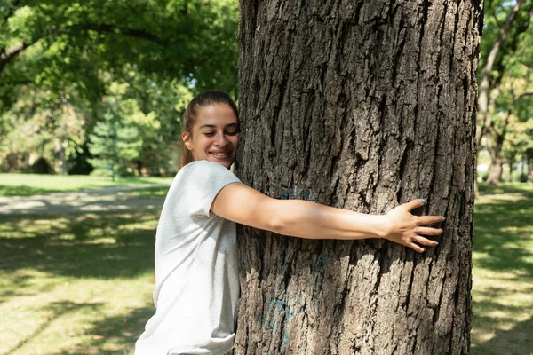

# User Personas

<!-- some introduction -->

---

<!-- a persona -->

## Their Role

- **Bio**: John,is a gardener, who likes to spend the weekend taking care of the
  garden and its trees.
- **Needs/Goals**: He needs help to improve the growth of his trees
- **Frustrations**: He can't find a website that teaches step-by-step
  instructions and explains it in a way that's easier to understand.
- **Scenario 1**: John had a problem with one of his trees, which wasn't growing
  and he is looking for information on what he can do to help with its growth,
  as it is a rare tree.

---

- **Bio**: Barbara is a biology student, who is looking for information for her
  thesis.
- **Needs/Goals**: Barbara needs a lot of resources.
- **Frustrations**: She doesn't find much information clear about the topic of
  her thesis.
- **Scenario 1**: Barbara is looking for websites with clear information about
  trees, very specific and clear information, so that she can include it in the
  sources of her thesis.

---

- **Bio**: Patricia is a born ecologist and is always looking for information.
- **Needs/Goals**: She is always looking for new and innovative information
  regarding the environment.
- **Frustrations**: It doesn't have much information about trees that are really
  concerned about the environment.
- **Scenario 1**: Patricia is looking for information that she can use for a
  protest she is going to make about the deforestation of forests.
